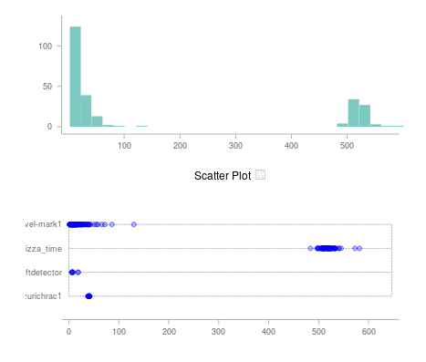

This project uses Flask, Requests and the [metricsgraphics.js](http://metricsgraphicsjs.org/)
library for time-series data, to collect and plot data from **The Things Network**.

This project was started at [Make Zurich 2017](https://makezurich.ch/). For some more
background, visit the [original project page](https://now.makezurich.ch/project/13).

# Starting

Install a virtualenv, activate, and `pip install -r requirements.txt`

Run `python ottnnc/__init__.py`.

Each chart is defined in the `project/buildui.py` file. The charts
are then assembled into a layout in `buildui.get_layouts`.
